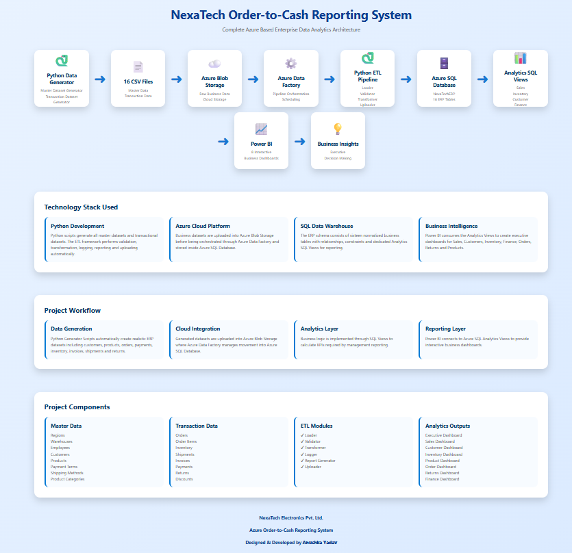
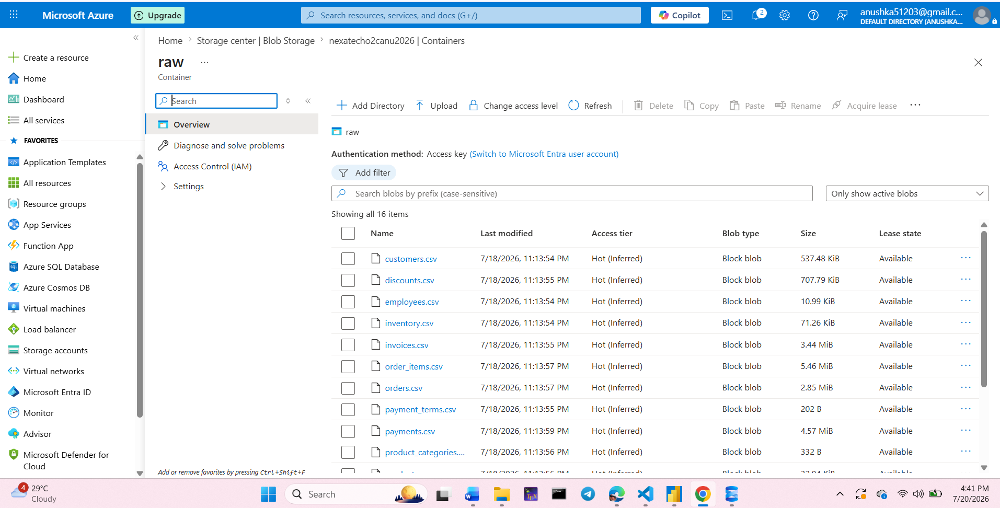
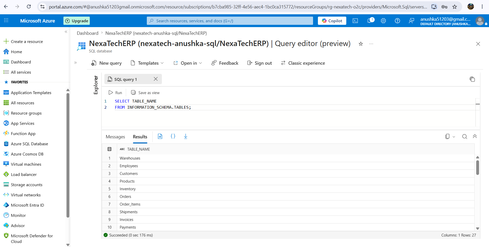
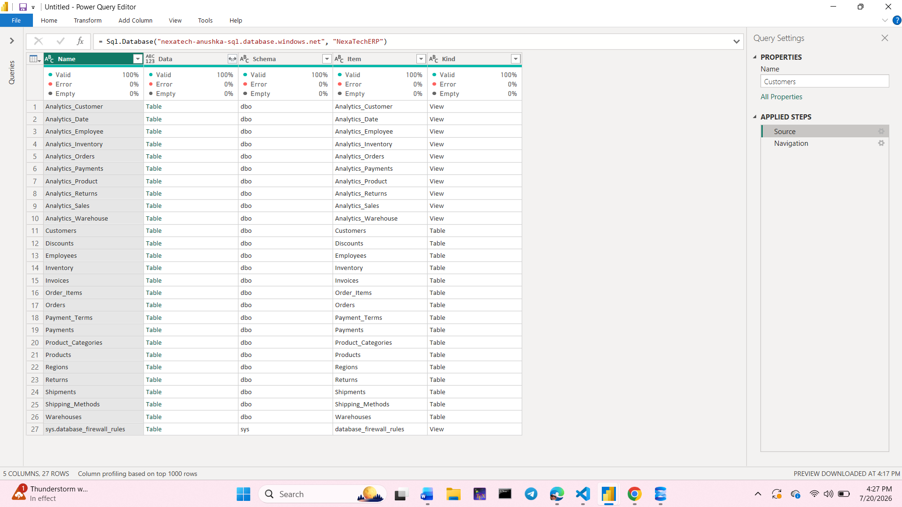
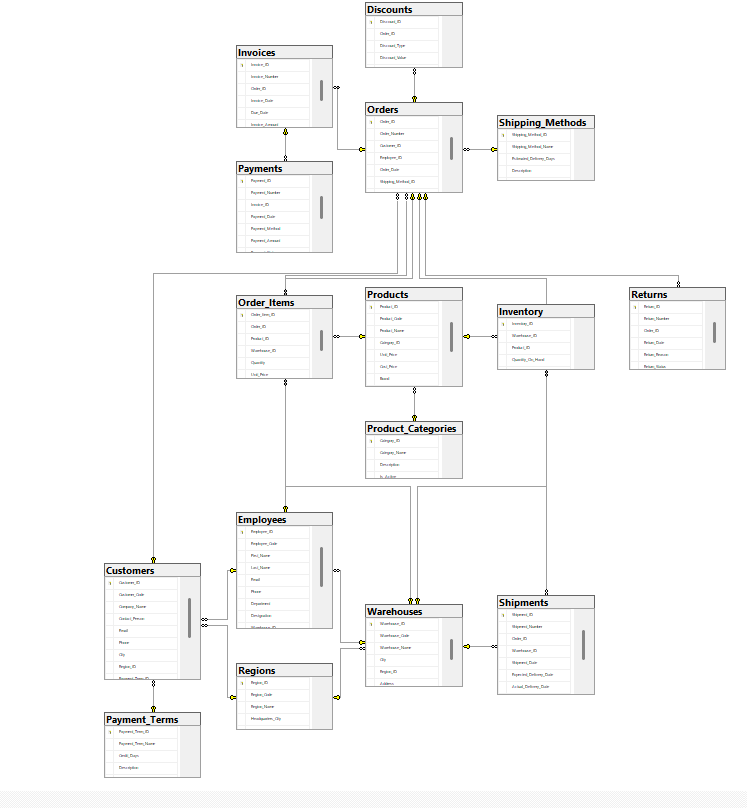
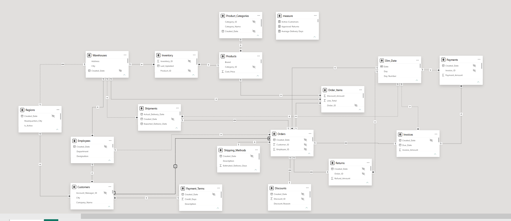

# 🚀 NexaTech Order-to-Cash Reporting System

> **End-to-End Azure Data Analytics Project**  
> Built using **Python, Azure SQL Database, Azure Blob Storage, Azure Data Factory concepts, SQL, and Power BI** to transform raw ERP transactions into business intelligence dashboards for executive decision-making.

---

## 📌 Project Overview

The **NexaTech Order-to-Cash (O2C) Reporting System** is an enterprise-scale analytics solution that simulates how modern organizations convert operational ERP transactions into meaningful business insights.

The project follows the complete **Order-to-Cash lifecycle**, beginning with synthetic ERP data generation, data validation, ETL processing, Azure cloud storage, Azure SQL Database deployment, analytical SQL reporting, and finally interactive Power BI dashboards.

Rather than focusing only on visualization, this project demonstrates the complete analytics pipeline used in real-world organizations.

---

## 🎯 Business Problem

Large organizations generate thousands of daily transactions across multiple departments.

These transactions are usually spread across different operational systems including:

- Customer Management
- Sales
- Inventory
- Warehousing
- Shipping
- Billing
- Payments
- Returns

Without a centralized reporting system, management cannot easily answer questions like:

- Which products generate the highest revenue?
- Which customers contribute the largest sales?
- Which warehouses have inventory shortages?
- Which invoices remain unpaid?
- Which regions perform the best?
- How efficient is the Order-to-Cash cycle?

The absence of integrated reporting often results in delayed decisions, inconsistent reporting, and poor operational visibility.

---

## 🎯 Project Objectives

This project aims to build a complete Order-to-Cash analytics solution capable of:

- Generating realistic ERP business datasets
- Validating and transforming raw transactional data
- Designing a normalized relational SQL database
- Loading enterprise datasets into Azure SQL Database
- Creating analytical SQL reporting views
- Building interactive executive dashboards in Power BI
- Demonstrating a modern Azure-based analytics architecture
- Simulating a real-world enterprise Business Intelligence solution

---

## 🛠 Technology Stack

| Category | Technologies |
|----------|--------------|
| Programming | Python |
| Data Processing | Pandas |
| Database | SQL Server, Azure SQL Database |
| Cloud | Azure Blob Storage, Azure Data Factory (Architecture) |
| Database Connectivity | PyODBC |
| Data Storage | CSV |
| Business Intelligence | Power BI |
| Version Control | Git & GitHub |
| Documentation | Markdown, HTML |

---

## 🏢 Business Domain

**Industry**

Electronics Manufacturing & Distribution

**Company**

NexaTech Electronics Pvt. Ltd.

**Business Process**

Order-to-Cash (O2C)

**Departments Covered**

- Sales
- Customers
- Warehouses
- Inventory
- Logistics
- Finance
- Returns

---
# 🏗 Solution Architecture

The NexaTech Order-to-Cash Analytics System follows a modern layered architecture that separates data generation, ingestion, processing, storage, analytics, and visualization.

The solution simulates a real enterprise reporting environment where transactional ERP data is transformed into executive-level business insights.

### High-Level Workflow

```
Python Data Generation
        ↓
Raw CSV Files
        ↓
Azure Blob Storage
        ↓
Azure Data Factory
        ↓
Azure SQL Database
        ↓
Analytics SQL Views
        ↓
Power BI Dashboards
        ↓
Business Decision Making
```

---

# 🏛 System Architecture

The following diagram illustrates the complete end-to-end architecture of the project.

<p align="center">

</p>

---

# ☁ Azure Cloud Architecture

This project leverages Microsoft Azure services to simulate an enterprise cloud analytics environment.

| Azure Service | Purpose |
|---------------|---------|
| Azure Blob Storage | Store raw ERP CSV files |
| Azure Data Factory | Data orchestration (architecture) |
| Azure SQL Database | Central enterprise data warehouse |
| Azure Portal | Cloud resource management |
| Power BI | Business Intelligence & Reporting |

### Azure Workflow

```
CSV Files
      ↓
Azure Blob Storage
      ↓
Azure Data Factory
      ↓
Azure SQL Database
      ↓
Analytics Views
      ↓
Power BI
```

---

# 📊 Azure Implementation Proof

The following screenshots demonstrate the Azure resources used throughout the project.

## Azure Blob Storage

<p align="center">

</p>

---

## Azure SQL Database

<p align="center">

</p>

---

## Power BI Azure Connection

<p align="center">

</p>

---

# 🗄 Database Design

The NexaTech ERP database consists of **16 normalized relational tables** representing the complete Order-to-Cash lifecycle.

### Master Tables

- Regions
- Warehouses
- Employees
- Customers
- Products
- Product Categories
- Shipping Methods
- Payment Terms

### Transaction Tables

- Orders
- Order Items
- Inventory
- Shipments
- Invoices
- Payments
- Returns
- Discounts

The database was designed using normalization principles with primary keys, foreign keys, and referential integrity.

---

## SQL Database Schema

<p align="center">

</p>

---

## Power BI Data Model

<p align="center">

</p>

---
# ⚙ Data Generation Framework

Unlike traditional analytics projects that rely on publicly available datasets, the NexaTech Order-to-Cash Analytics System generates a complete enterprise ERP dataset using Python.

The project contains separate data generators for:

## Master Data

- Regions
- Warehouses
- Employees
- Customers
- Products
- Product Categories
- Shipping Methods
- Payment Terms

## Transaction Data

- Orders
- Order Items
- Inventory
- Shipments
- Invoices
- Payments
- Returns
- Discounts

More than **8,000+ realistic ERP records** are generated with relational integrity between all entities.

---

# 🔄 ETL Framework

A modular ETL framework was developed to automate the complete data processing pipeline.

## ETL Modules

| Module | Purpose |
|---------|----------|
| Loader | Reads raw CSV files |
| Validator | Performs data quality checks |
| Transformer | Cleans and transforms datasets |
| Logger | Tracks ETL execution logs |
| Report Generator | Generates Data Quality Reports |
| Uploader | Loads processed datasets into Azure SQL Database |
| Pipeline | Executes the complete ETL workflow |
| Config | Stores project configuration |

The ETL framework ensures:

- Data consistency
- Referential integrity
- Duplicate handling
- Missing value validation
- Execution logging
- Quality reporting

---

# 📈 ETL Reports

The ETL process automatically generates execution reports for monitoring and auditing.

Available reports include:

- Data Quality Report
- ETL Execution Log

These reports help verify that the data loaded into Azure SQL Database meets quality standards before analytics are performed.

---

# 📊 Analytics SQL Layer

A dedicated Analytics Layer was created on top of the operational database.

Instead of querying transactional tables directly, Power BI consumes analytical SQL views optimized for reporting.

### Analytical Views

- Customer Analytics
- Sales Analytics
- Product Analytics
- Warehouse Analytics
- Employee Analytics
- Inventory Analytics
- Orders Analytics
- Payments Analytics
- Returns Analytics
- Date Analytics

This reporting layer improves performance while keeping operational tables isolated from analytical queries.

---

# 📉 Business Intelligence Dashboards

Interactive Power BI dashboards were developed to support multiple business departments.

The dashboards provide KPI monitoring, trend analysis, operational visibility, and executive decision support.

---

## 🏠 Home Dashboard

<p align="center">

</p>

---

## 👔 Executive Dashboard

<p align="center">

</p>

---

## 💰 Sales Dashboard

<p align="center">

</p>

---

## 👥 Customer Dashboard

<p align="center">

</p>

---

## 📦 Inventory Dashboard

<p align="center">

</p>

---

## 🚚 Logistics Dashboard

<p align="center">

</p>

---

## 💳 Finance Dashboard

<p align="center">

</p>

---

## ↩ Returns Dashboard

<p align="center">

</p>

---
# 📁 Repository Structure

```text
NexaTech_Order_to_Cash_Analytics
│
├── architecture/
│
├── data/
│   
│
├── etl_reports/
│
|___ png/
|    |__dashboards/
|
|
├── python/
│   ├── etl/
│   ├── master/
│   ├── transactions/
│   ├── sql/
|       |__analytics/
│   ├── azure_blob_connection.py
│   ├── data_validation.py
│   ├── fix_customers.py
│   ├── load_all_datasets.py
│   └── read_from_blob.py
│
├── screenshots/
│
├── sql/
│   ├── Database Scripts
│   
│
├── README.md
├── LICENSE
└── requirements.txt
```

---

# 🚀 Getting Started

## Clone Repository

```bash
git clone https://github.com/anusshkaydv/NexaTech_Order_to_Cash_Analytics.git
```

---

## Install Python Dependencies

```bash
pip install -r requirements.txt
```

---

## Generate ERP Data

Run the master data generators followed by transaction data generators.

```bash
python python/master/generate_regions.py
python python/master/generate_products.py
...
```

---

## Execute ETL Pipeline

```bash
python python/etl/pipeline.py
```

---

## Deploy Database

Run the SQL scripts sequentially.

```
01_create_database.sql

↓

02_create_regions.sql

↓

...

↓

18_create_discounts.sql
```

---

## Load Data into Azure SQL Database

```bash
python python/sql/load_to_sql.py
```

---

## Open Power BI

Connect Power BI Desktop to:

```
Azure SQL Database

↓

Analytics SQL Views

↓

Refresh

↓

Interactive Dashboards
```

---

# 🎥 Project Demonstration

A complete walkthrough of the project is available below.

👉 **Project Demo Video**


```
https://drive.google.com/file/d/1UnmyKScpzQz2Q4c1dlcnSKqa-wRuqahy/view?usp=sharing
```

---

# 🌟 Key Features

✔ End-to-End Azure Data Analytics Solution

✔ ERP Data Generation using Python

✔ Automated ETL Framework

✔ Azure SQL Database Deployment

✔ Azure Blob Storage Integration

✔ Analytics SQL Views

✔ Interactive Power BI Dashboards

✔ Executive KPI Reporting

✔ Enterprise Data Modeling

✔ Data Validation & Quality Reporting

---

# 🔮 Future Enhancements

Future versions of this project may include:

- Azure Data Factory pipeline automation
- Incremental ETL processing
- Azure Synapse Analytics
- Microsoft Fabric Integration
- Power BI Service deployment
- Row-Level Security (RLS)
- Real-time reporting
- REST API integration
- CI/CD pipeline deployment
- Automated monitoring dashboards

---

# 👩‍💻 Author

## Anushka Yadav

**B.Tech Computer Science & Engineering (AI & ML)**

Aspiring **Data Analyst | Business Intelligence Analyst | Azure Data Analytics Enthusiast**

---

# ⭐ Support

If you found this project useful, consider giving the repository a ⭐ on GitHub.

It motivates me to continue building enterprise-grade analytics projects.

---

# 📜 License

This project is licensed under the **MIT License**.

See the LICENSE file for details.
